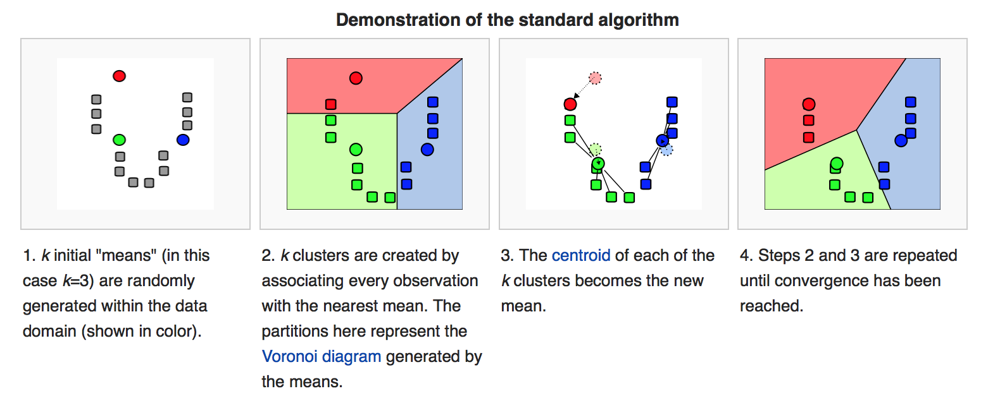
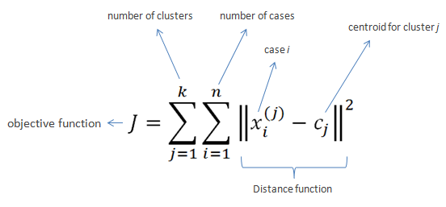

# K-MEANS vs DBSCAN


```
https://yganalyst.github.io/ml/ML_clustering/
https://process-mining.tistory.com/122
```


## K-MEANS Clustering

K-means는 Center-based 클러스터링 방법으로 "유사한 데이터는 중심점(centroid)을 기반으로 분포할 것이다"는 가정을 기반으로 한다.

n개의 포인트 클라우드 데이터와 k(<=n)개의 중심점(centeroid)이 주어졌을 때 각 그룹 내의 데이터와 중심점 간의 비용(거리)을 최소화하는 방향으로 계속 업데이트를 해줌으로써 그룹화를 수행하는 기법이다.


장점

- 쉽고 빠르게 연산이 가능하다
- local minimum으로 수렴한다

단점

- k 값을 사용자가 임의로 정해야 하고, 처음의 centroid도 임의로 정해야 한다. 또한 처음의 centroid를 어떻게 정하느냐에 따라서 cluster 결과가 민감하게 변한다.
- 최적의 k를 찾기가 어려움.
- Outlier에 민감하다.





1. 초기점(k) 설정
   - k는 중심점(centroid)이자, 묶일 그룹(cluster)의 수와 같다.
2. 그룹(cluster) 부여
   - k개의 중심점과 개별 데이터간의 거리를 측정하고, 가장 가까운 중심점으로 데이터를 부여한다.
3. 중심점(centroid) 업데이트
   - 할당된 데이터들의 평균값(mean)으로 새로운 중심점(centroid)을 업데이트 한다.
4. 최적화
   - 2,3번 작업을 반복적으로 수행한다.
   - 변화가 없으면 작업을 중단한다.