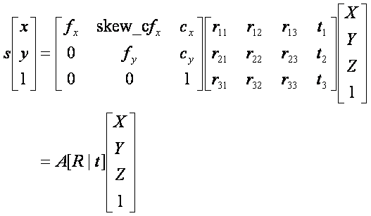

# calibration


```
https://darkpgmr.tistory.com/32
```




여기서, (X,Y,Z)는 월드 좌표계(world coordinate system)상의 3D 포인트의 좌표, [R|t]는 월드 좌표계를 카메라 좌표계로 변환시키기 위한 회전/이동변환 행렬이며 A는 intrinsic camera matrix이다.


1. 포인트클라우드
2. y,z 필터링 & 복셀
3. DBSCAN

: 

1. 박스안에 소속된 